# 📖 Turjuman: Your Smart Book Translation System - Locally and privately hosted 🌍

 

Welcome to **Turjuman** (ترجمان - *Interpreter/Translator* in Arabic)! 👋

Ever felt daunted by translating a massive book (like 500 pages and over 150,000 words!)? Turjuman is here to help! (currently Markdown `.md` and plain text `.txt` files) using LLMs to magaically translate large documents while trying smartly keep the original meaning and style intact.

---

## ✨ How Turjuman Works

Turjuman uses a smart pipeline powered by LangGraph 🦜🔗:

1. **🚀 init_translation**: Start the translation job
2. **🧐 terminology_unification**: Find and unify key terms
3. **✂️ chunk_document**: Split the book into chunks
4. **🌐 initial_translation**: Translate chunks in parallel
5. **🤔 critique_stage**: Review translations, catch errors
6. **✨ final_translation**: Refine translations
7. **📜 assemble_document**: Stitch everything back together

### 📊 Translation Flow

```mermaid
flowchart TD
    A([🚀 init_translation<br><sub>Initialize translation state and configs</sub>]) --> B([🧐 terminology_unification<br><sub>Extract key terms, unify glossary, prepare context</sub>])
    B --> C([✂️ chunk_document<br><sub>Split the book into manageable chunks</sub>])

    %% Chunking produces multiple chunks
    C --> D1([📦 Chunk 1])
    C --> D2([📦 Chunk 2])
    C --> D3([📦 Chunk N])

    %% Parallel translation workers
    D1 --> E1([🌐 initial_translation<br><sub>Translate chunk 1 in parallel</sub>])
    D2 --> E2([🌐 initial_translation<br><sub>Translate chunk 2 in parallel</sub>])
    D3 --> E3([🌐 initial_translation<br><sub>Translate chunk N in parallel</sub>])

    %% Merge all translations
    E1 --> F([🤔 critique_stage<br><sub>Review translations, check quality and consistency</sub>])
    E2 --> F
    E3 --> F

    %% Decision after critique
    F --> |No critical errors| G([✨ final_translation<br><sub>Refine translations based on feedback</sub>])
    F --> |Critical error| H([🛑 End<br><sub>Stop translation due to errors</sub>])

    G --> I([📜 assemble_document<br><sub>Merge all refined chunks into final output</sub>])
    I --> J([🏁 Done<br><sub>Translation complete!</sub>])

    H --> J
```



---

## 🛠️ Setup & Installation using Docker (Recommended)

**Recommended LLM Models**
- **Online**: Gemini Flash/Pro
- **Local**: Gemma3 / Aya / Mistral 


### Prerequisites

- [Docker](https://docs.docker.com/get-docker/) installed on your system.
- **API Keys**: Get your API keys for OpenAI, Anthropic, Gemini ..etc to provide access to advanced LLM
- **Ollama**: You can use Turjuman locally without paying for LLM by installing Ollama or any Local Inference server like LMstudio, vLLM, LLamaCPP ..etc, take alook at sample.env for details


## Prepare Environment Variables

copy `sample.env.file` to `.env` and modify the prefered LLM and keys

### Building the Docker Image

1. Open a terminal and navigate to the project root directory (where the `Dockerfile` is located).
2. Build the Docker image with the following command:

   ```bash
   docker build -t turjuman-book-translator .
   ```

   This command will create a Docker image named `turjuman-book-translator`.

### Basic Run with web UI (include streaming)

To run the app on the default bridge network, map port 8051:8051, If you use Ollama or self-hosted LLM then you must use the option **--add-host** to enable all self hosting LLM

```bash
docker run --rm -it \
   -v "$(pwd):/app/" \
  --network bridge \
  -p 8051:8051 \
  --env-file sample.env.file \
  --add-host host.docker.internal:host-gateway \
  turjuman-book-translator
```

- `--network bridge` (optional) specifies the default Docker bridge network.
- `-p 8051:8051` maps port 8051 of the container to port 8051 on your host.
- `--add-host host.docker.internal:host-gateway` allows the container to access services running on the host (ollama or local ai service) using the name `host.docker.internal`.

The application will now be accessible at [http://localhost:8051](http://localhost:8051).

---
## 🚀 Using Turjuman via integrated web UI 

visit [http://localhost:8051](http://localhost:8051)
- select file to translate
- modify the source and target language 
- modify the "Accent and style" if needed (this option can make translation more funny, spicy or professional by default)
- start translation, after few seconds both logs, text chunks will update dynamically
- after translation progress reach 100% you can view or download the final MarkDown file 
- you can change the theme from top drop menue (7 themes available) 
- you can switch the view between chunk or full document to review the translated content chunk by chunk 


## 🛠️ Setup & Installation using conda or venv (for development)

1. **Prerequisites**

- **Conda**: Install [Miniconda](https://docs.conda.io/en/latest/miniconda.html) or [Anaconda](https://www.anaconda.com/products/distribution)
- **API Keys**: Get your API keys for OpenAI, Anthropic, etc.
- **Ollama**: You can use Turjuman locally without paying for LLM by installing Ollama or any Local Inference server like LMstudio, vLLM, LLamaCPP ..etc, take alook at sample.env for details


2. **Clone the Repository**

```bash
git clone <your-repo-url>
cd turjuman-book-translator
```

3. **Create Conda Environment**

```bash
conda create -n turjuman_env python=3.12 -y
conda activate turjuman_env
```

4. **Install Dependencies**

```bash
pip install langchain langgraph langchain-openai langchain-anthropic langchain-google-genai langchain-community tiktoken python-dotenv markdown-it-py pydantic "langserve[server]" sse-starlette aiosqlite uv streamlit
```

5. **Configure Environment Variables**

```bash
cp sample.env.file .env
# Edit .env and add your API keys
```

6. **Run Backend Server**

```bash
uvicorn src.server:app --host 0.0.0.0 --port 8051 --reload
```

7. **Run Streamlit Frontend**

```bash
streamlit run translate_over_api_frontend_streamlit.py
```

---

## 🚀 Using Turjuman via Streamlit

1. **Configure**: Set API URL, source & target languages, provider, and model
2. **Upload**: Your `.md` or `.markdown` file
3. **Start Translation**: Click the button and watch the magic happen! ✨
4. **Review**: See original and translated side-by-side, or chunk-by-chunk
5. **Download**: Get your translated book or the full JSON response

---
## 🖼️ Streamlit App Preview (old UI)


---
##  BASH Script Client

A convenient command-line client script (`translate_over_api_terminal.sh`) is provided for interacting with the backend API.

**Prerequisites:** `curl`, `jq`

**Getting Help:**

The script includes detailed usage instructions. To view them, run:

```bash
./translate_over_api_terminal.sh --help
```
or
```bash
./translate_over_api_terminal.sh -h
```

**Basic Usage:**

The only required argument is the input file (`-i` or `--input`). Other options allow you to specify languages, provider, model, API URL, and output file path.

```bash
# Translate a file using default settings (English->Arabic, OpenAI provider, default model)
# Ensure OPENAI_API_KEY is set in .env if using openai
./translate_over_api_terminal.sh -i path/to/your/document.md

# Specify languages, provider, model, and save response to a specific file
./translate_over_api_terminal.sh \
  --input my_book.md \
  --output results/my_book_translated.json \
  --source english \
  --target french \
  --provider ollama \
  --model llama3

# Use a different API endpoint
./translate_over_api_terminal.sh -i chapter1.md -u http://192.168.1.100:8051

# List available models fetched from the backend API
./translate_over_api_terminal.sh --list-models
```

The script submits the job via the API. Since the API call is synchronous, the script waits for completion and saves the full JSON response (containing the final state and the translated document in `output.final_document`) to a file (default: `<input_name>_<job_id>.json` or the path specified with `--output`). It also provides the `curl` command to retrieve the final state again using the job ID.

---
---
## 🗺️ Future Plans

- Support for PDF, DOCX, and other formats
- More advanced glossary and terminology management
- Interactive editing and feedback loop
- Better error handling and progress tracking

---

## 🤝 Contributing

Pull requests welcome! For major changes, open an issue first.

---

## 📄 License

MIT

---

Enjoy translating your books with Turjuman! 🚀📚🌍