# 📖 Turjuman: Your Book Translation Sidekick! 🌍

[](https://github.com/sindresorhus/awesome)  

Welcome to **Turjuman** (ترجمان - *Interpreter/Translator* in Arabic)! 👋

Ever felt daunted by translating a massive book (like 500 pages!)? Turjuman is here to help! (currently Markdown `.md` and plain text `.txt` files) using LLMs to magaically translate large documents while trying smartly keep the original meaning and style intact.

---

## 🛠️ Setup & Installation

1. **Prerequisites**

- **Conda**: Install [Miniconda](https://docs.conda.io/en/latest/miniconda.html) or [Anaconda](https://www.anaconda.com/products/distribution)
- **API Keys**: Get your API keys for OpenAI, Anthropic, etc.

2. **Clone the Repository**

```bash
git clone <your-repo-url>
cd turjuman-book-translator
```

3. **Create Conda Environment**

```bash
conda create -n turjuman_env python=3.12 -y
conda activate turjuman_env
```

4. **Install Dependencies**

```bash
pip install langchain langgraph langchain-openai langchain-anthropic langchain-google-genai langchain-community tiktoken python-dotenv markdown-it-py pydantic "langserve[server]" sse-starlette aiosqlite uv streamlit
```

5. **Configure Environment Variables**

```bash
cp sample.env.file .env
# Edit .env and add your API keys
```

6. **Run Backend Server**

```bash
uvicorn src.server:app --host 0.0.0.0 --port 8051 --reload
```

7. **Run Streamlit Frontend**

```bash
streamlit run translate_over_api_frontend_streamlit.py
```

---

## ✨ How Turjuman Works

Turjuman uses a smart pipeline powered by LangGraph 🦜🔗:

1. **🚀 init_translation**: Start the translation job
2. **🧐 terminology_unification**: Find and unify key terms
3. **✂️ chunk_document**: Split the book into chunks
4. **🌐 initial_translation**: Translate chunks in parallel
5. **🤔 critique_stage**: Review translations, catch errors
6. **✨ final_translation**: Refine translations
7. **📜 assemble_document**: Stitch everything back together

### 📊 Translation Flow

```mermaid
graph TD
    A[Start 🚀<br>init_translation] --> B{Terminology Unification 🧐<br>terminology_unification}
    B --> C[Chunk Document ✂️<br>chunk_document]
    C --> D[Parallel Translation 🌐<br>initial_translation]
    D --> E{Critique Stage 🤔<br>critique_stage}
    E -- No Critical Errors --> F[Final Translation ✨<br>final_translation]
    E -- Critical Error --> G([End 🛑])
    F --> H[Assemble Document 📜<br>assemble_document]
    H --> G
```



---

## 🚀 Using Turjuman via Streamlit

1. **Configure**: Set API URL, source & target languages, provider, and model
2. **Upload**: Your `.md` or `.markdown` file
3. **Start Translation**: Click the button and watch the magic happen! ✨
4. **Review**: See original and translated side-by-side, or chunk-by-chunk
5. **Download**: Get your translated book or the full JSON response

---

## 🗺️ Future Plans

- Support for PDF, DOCX, and other formats
- More advanced glossary and terminology management
- Interactive editing and feedback loop
- Better error handling and progress tracking

---

## 🤝 Contributing

Pull requests welcome! For major changes, open an issue first.

---

## 📄 License

MIT

---

Enjoy translating your books with Turjuman! 🚀📚🌍